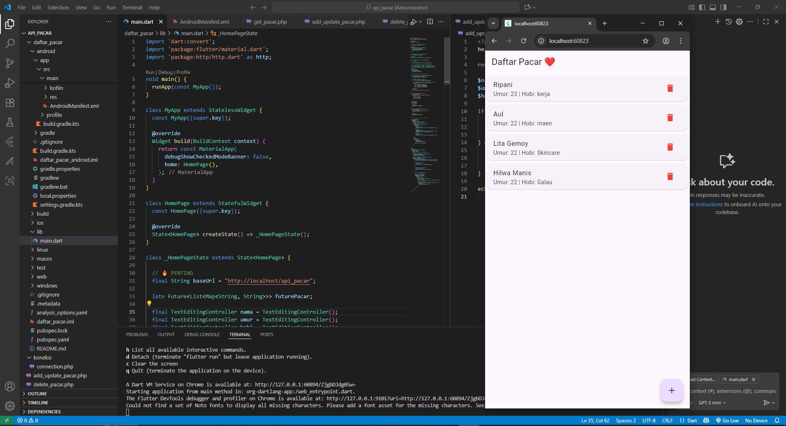
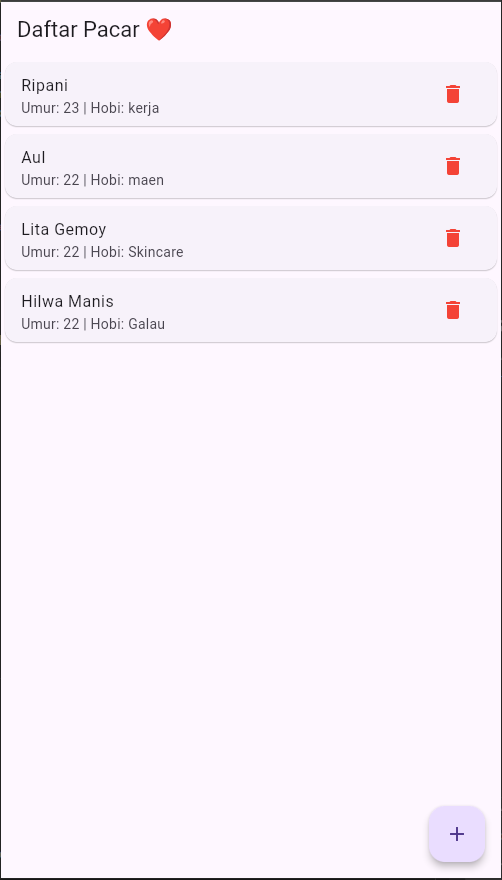
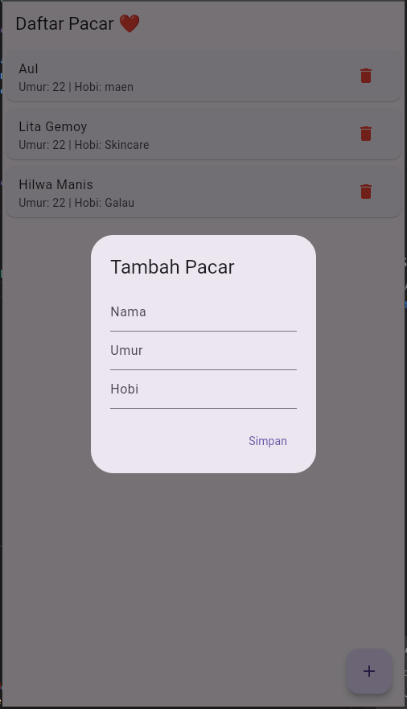
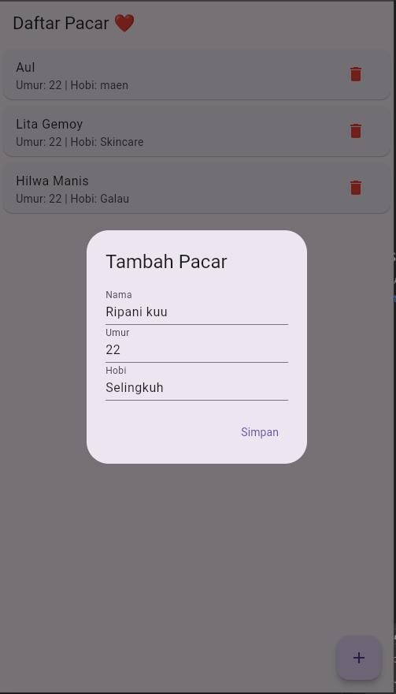
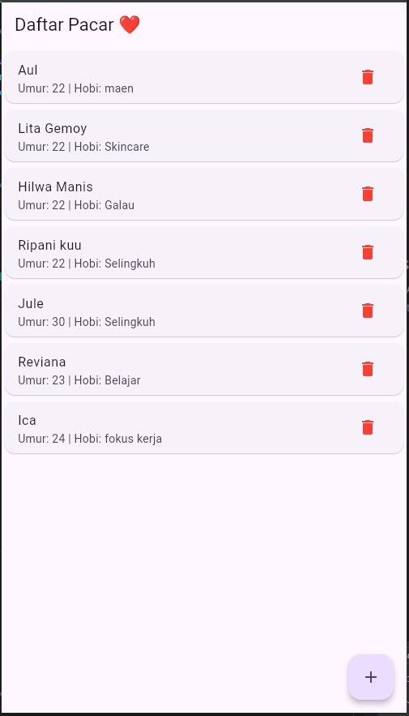
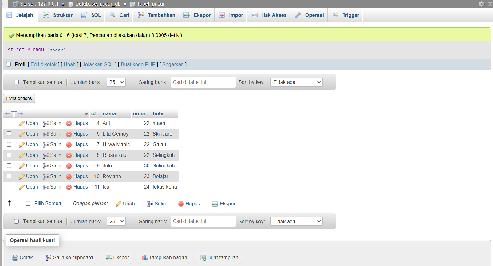

# ❤️ Daftar Pacar App (Flutter CRUD)

  
  
  

  
  
  

---

## 👤 Identitas

**Mata Kuliah** : Pemrograman Mobile 2  
**Topik** : CRUD (Create, Read, Update, Delete)  
**Platform** : Flutter  
**Backend** : PHP Native + MySQL (XAMPP)  
**Storage** : Cloud Storage Sederhana (API PHP)  
**Tema Aplikasi** : Daftar Pacar ❤️  

---

## 📌 Deskripsi Aplikasi

**Daftar Pacar App** adalah aplikasi mobile berbasis **Flutter** yang menerapkan konsep **CRUD (Create, Read, Update, Delete)** dengan memanfaatkan **API PHP** dan **database MySQL** sebagai cloud storage sederhana.

Aplikasi ini memungkinkan pengguna untuk:
- Menambahkan data pacar
- Melihat daftar pacar
- Menghapus data pacar
- Sinkronisasi data secara realtime dengan database

Aplikasi dirancang dengan **UI/UX modern**, clean, dan user-friendly menggunakan **Material 3**.

---

## ⚙️ Fitur Utama

- ✅ Create data pacar  
- ✅ Read data pacar (Realtime dari database)  
- ✅ Delete data pacar  
- ✅ Integrasi Flutter dengan REST API PHP  
- ✅ Koneksi MySQL menggunakan PDO  
- ✅ Bottom Sheet Input  
- ✅ Konfirmasi hapus data  

---

## 🗂️ Struktur Project

### 📁 Flutter
👤 Identitas Mahasiswa 😎

Nama : Zainuddin Muhammad Zakiy

NIM : 23552011173

Kelas : TIF K 23B

Universitas : Universitas Teknologi Bandung

📌 Catatan

Project ini dibuat untuk memenuhi tugas Pemrograman Mobile 2, dengan fokus pada:

Integrasi Flutter dengan Backend

CRUD berbasis Cloud Storage sederhana

Penerapan UI/UX modern
